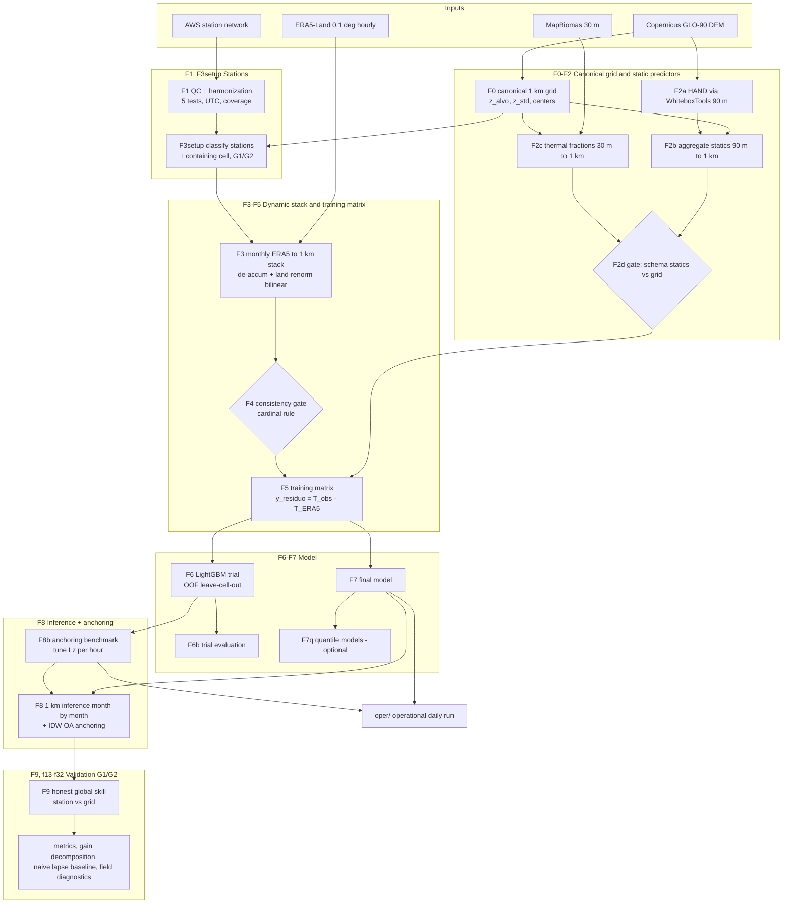

# ERA5-Land → 1 km air-temperature downscaling with observation-anchored objective analysis

Pipeline for statistical downscaling of ERA5-Land 2 m air temperature to a 1 km
grid over **Santa Catarina, Brazil**, with an observation-anchored
objective-analysis (OA) step and a spatially stratified (G1/G2) validation.

This repository accompanies the manuscript:

> *Statistical downscaling of ERA5-Land air temperature to 1 km with
> observation-anchored objective analysis: a spatially stratified validation
> for agroclimatic use over Santa Catarina, Brazil.*
> C. E. S. de Araujo & G. L. Rodrigues (Epagri/Ciram).

## What it does

The reanalysis background (ERA5-Land, ~9 km) cannot resolve the
elevation- and coast-driven thermal gradient of a domain that packs a coastal
plain, a coastal escarpment and an elevated interior into ~95 700 km²
(station elevation 2–1790 m; distance to coast a few metres to ~630 km). The
pipeline:

1. corrects the ERA5-Land residual with a **LightGBM** model over 55 predictors
   (topography, land cover, geography, reanalysis fields, temporal and derived
   features), trained on the target `y_residuo = T_obs − T_ERA5(bilinear)`;
2. **anchors** the downscaled field to station observations by inverse-distance
   objective analysis with elevation weighting
   (`w = (1/dᵖ)·exp(−(Δz/Lz)²)`, `k=20, p=1, Lz=500 m`, no cutoff radius),
   interpolating the model's out-of-sample increment;
3. **validates** honestly against two spatial-independence levels — **G1**
   (stations sharing a 1 km cell with a training station; out-of-sample for
   anchoring only) and **G2** (fully independent of both training and anchoring).

At the fully independent (G2) stations, hourly RMSE falls **0.96 °C below native
ERA5-Land** (95 % CI 0.70–1.28); about **0.76 °C** is attributable to the
downscaling and **0.25 °C** to the anchoring — estimated separately, not
additive. Most of the reduction is the elevation correction any lapse rate
performs (the downscaling's own margin over a region-tuned lapse baseline is
narrow); the anchoring reduces random error, not bias, decays with distance to
the network, is negligible for daily minimum temperature, and leaves a
disqualifying cold bias in daily maximum temperature. Frost-season performance
is untested.

## Study period

- **Training:** 2020–2025 (six complete years → full annual cycle).
- **Verification:** January–June 2026 (out-of-time; a convenience block of the
  current operational cycle — no claim on the second-semester highland frost
  season).

## Data sources (not redistributed here)

| Layer | Source | Native res. |
|---|---|---|
| 2 m temperature + predictor fields | ERA5-Land (Muñoz-Sabater et al. 2021) | 0.1° (~9 km), hourly |
| Terrain (`z_alvo`, `z_std`) | Copernicus GLO-90 DEM | 90 m → 1 km |
| Land cover | MapBiomas (Souza et al. 2020) | 30 m |
| Surface observations | State agrometeorological AWS network (Epagri/Ciram) | station |

Bring your own credentials/paths for ERA5-Land (CDS API) and the station
database. All spatial layers use EPSG:31982 (UTM 22S); canonical grid is
560 × 807 at 1 km.

## Scope of this repository

This repository ships the **core pipeline (F0–F8)** and its orchestrator
`run_pipeline.sh` — everything that builds the grid, the training matrix, the
model, and the anchored 1 km field. The **evaluation suite** (F9, `f13`–`f32`:
metrics, gain decomposition, naive-lapse baseline, field diagnostics) and the
**operational path** (`oper/`) are described below and in the manuscript but are
**not included here**; they consume the F8 outputs to reproduce Section 3
(Results). Rows marked *(not shipped)* in the stage table are those parts.

## Bundled derived data (`dados/`)

To make the repo self-contained **except for the raw ERA5-Land and station
data**, the derived artifacts the model stages need as inputs are shipped under
[`dados/`](dados/):

| Folder | What | Built by |
|---|---|---|
| `dados/grid_1km/` | canonical 1 km grid (`cop1km`=`z_alvo`, `z_std`, cell centers, SC mask, ERA5 orography) | F0 |
| `dados/estaticas_1km/` | 31 static predictors (topography, HAND, dist-to-coast, thermal land-cover fractions) | F2a–F2c |
| `dados/matriz/` | training matrix `matriz_treino.parquet` (57 features, `y_residuo` target) + sidecars | F5 |

With these present, **F5→F8 run offline** (train the model, infer the 1 km field)
without regenerating F0–F2. **How each layer was generated (GDAL / Python), layer
by layer, is documented in [`dados/README.md`](dados/README.md).** The matrix
embeds *derived station residuals* (not raw series) and is included by explicit
choice. `dados/matriz/matriz_treino.parquet` is ~745 MB — **version it with Git
LFS**; `.gitignore` re-includes `dados/` on top of the global `*.tif`/`*.parquet`
rules.

Still **not** in the repo: raw ERA5-Land, the station database, the raw DEM /
MapBiomas sources, the monthly ERA5 1 km stack, and the trained models — all
under `DOWNSCALING_ROOT/…` (see the table above and `.env.example`).

## Configuration

Two roots, both env-configurable:

```bash
export DOWNSCALING_ROOT=/path/to/your/data   # raw + heavy outputs; see .env.example
# DIR_GRID / DIR_ESTATICAS / DIR_MATRIZ default to the bundled dados/ above;
# override only to point the derived layers elsewhere.
```

Every Python script reads them via `_root.py`; `run_pipeline.sh` passes
`DOWNSCALING_ROOT` through. Expected below it: `Dados/ERA5_land/…`,
`Dados/MDTs/…`, `stn_data/…`, `saidas/…` (ERA5 1 km stack + models). The grid,
static predictors and training matrix come from `dados/` by default.

## Pipeline



### Stage reference

| Step | Script | Role |
|---|---|---|
| F0 | `f0_grade_canonica.py` | Canonical 1 km grid (`z_alvo`, `z_std`, cell centers) |
| F1 | `f1_qc_estacoes.py` | Station QC + harmonization (5 sequential tests) |
| F2a | `f2a3_hand_wbt.py` | HAND via WhiteboxTools (90 m) |
| F2b | `f2b_agrega_1km.py` | Aggregate static layers 90 m → 1 km |
| F2c | `f2c_fracoes_1km.py` | Thermal land-cover fractions 30 m → 1 km |
| F2d | `f2d_schema_teste.py` | Gate: static-layer schema vs grid |
| F3setup | `f3_setup_estacoes.py` | Station classification + containing cell (G1/G2) |
| F3 | `f3_era5_1km.py` | Monthly ERA5-Land → 1 km stack (parallel by month) |
| F4 | `f4_gate_consistencia.py` | Consistency gate (cardinal rule); `f4_motor_extracao.py` is an imported module |
| F5 | `f5_matriz_treino.py` | Training matrix (`y_residuo`) |
| F6 | `f6_ensaio_lightgbm.py` | LightGBM trial, OOF leave-cell-out |
| F6b | `f6b_avalia_ensaio.py` | Trial evaluation (tables/figures) |
| F7 | `f7_treina_final.py` | Final model (single source consumed by F8) |
| F7q | `f7q_treina_quantil.py` | Quantile-segmented models (optional) |
| F8b | `f8b_bench_ancoragem.py` | Anchoring benchmark, tune `Lz` per hour |
| F8 | `f8_infere_grade.py` | 1 km inference month-by-month + IDW OA anchoring |
| F9 | `scripts_avaliacao/f9_compara_t2_estacao_grade.py` | Honest global station-vs-grid skill — *(not shipped)* |
| Eval | `scripts_avaliacao/f13..f32` | Metrics, extremes, stratification, significance, naive lapse baseline, field diagnostics — *(not shipped)* |
| Oper | `oper/*` | Operational daily run (Barnes anchoring, 6-day latency) — *(not shipped)* |

> **Train vs operational:** evaluation uses IDW anchoring; the operational path
> (`oper/`) uses Barnes with a ~6-day latency and no formal retrain cadence —
> a deliberate, documented difference (manuscript §2.8).

## Running

```bash
# full pipeline (stops on any error)
nohup ./run_pipeline.sh > logs/pipeline.log 2>&1 &

# resume from a step (skips earlier ones)
DE=f7 ./run_pipeline.sh
```

Useful env vars (defaults in `run_pipeline.sh`): `PY`, `ANO_INI`/`ANO_FIM` (F3),
`F8_INI`/`F8_FIM` (F8), `F3_JOBS`, `FEATURES`, `TAG`, `ANCORA` (1|0), `F7Q` (0|1).

> F3 uses ~16 GB RAM per month; `F3_JOBS=4` ≈ 64 GB peak — size it to your host.

## Requirements

Python 3.12. Install into an isolated environment:

```bash
python -m venv .venv && source .venv/bin/activate
pip install -r requirements.txt
```

Core stack: `numpy`, `pandas`, `pyarrow`, `xarray`, `netCDF4`, `rioxarray`,
`rasterio`, `pyproj`, `scipy`, `scikit-learn`, `lightgbm`, `matplotlib`, and
`whitebox` (WhiteboxTools, for HAND in F2a). Full list in `requirements.txt`.

## Validation design (G1/G2)

- **G1** — 12 stations sharing a 1 km cell with a training station; out-of-sample
  for the anchoring step *only* (`holdout_lightgbm=False`). **Not** an
  independent test set for the model.
- **G2** — 13 fully independent stations: 0 training rows, widely scattered
  across the domain; the primary inferential set (gains `g_lgbm`, `g_anc`,
  `g_tot`).

Unit of analysis is the **station**; metrics are computed per station then
aggregated (median/IQR), not pooled over station-hours. Confidence intervals are
2.5–97.5 % percentile intervals from 2000 bootstrap resamples of the stations
(fixed seed); differences tested with the two-sided Wilcoxon signed-rank test
paired by station; no multiple-comparison correction (a small primary
inferential set is designated instead, and other intervals read as descriptive).

## Method placement (what this is and is not)

A statistical downscaling followed by a **prescribed-weight objective analysis**
of the Cressman–Barnes family. It is **not** optimal interpolation or data
assimilation: no background- or observation-error covariance matrices are
estimated.

## License / citation

See `LICENSE`. If you use this code, please cite the manuscript above.
